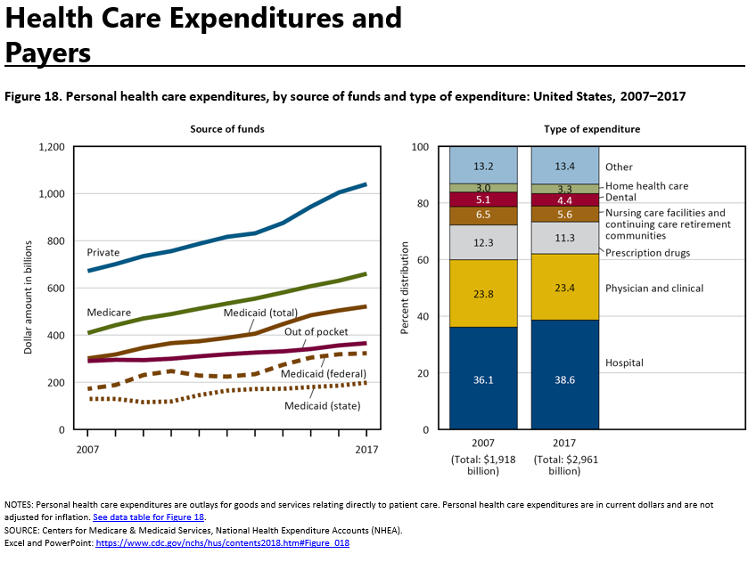
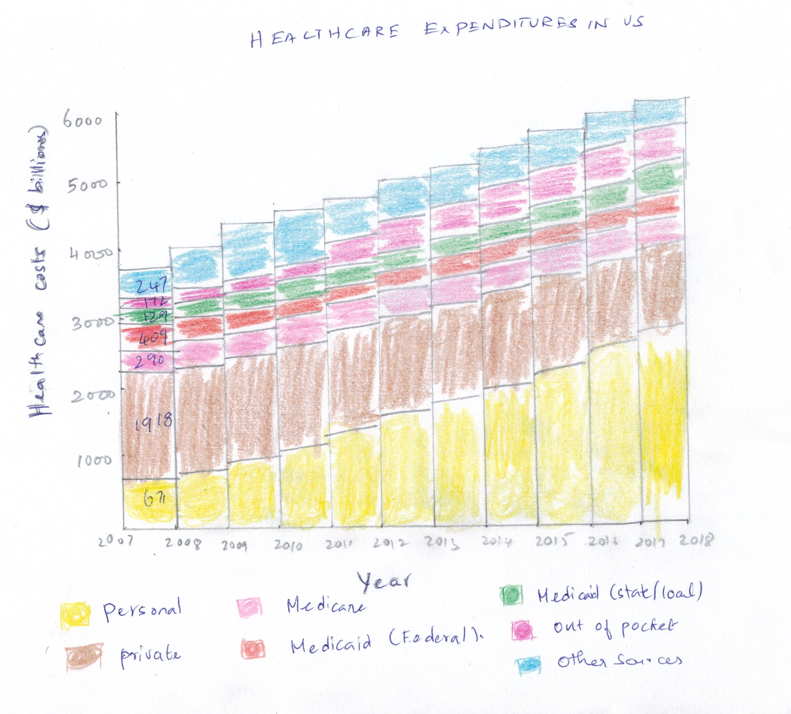
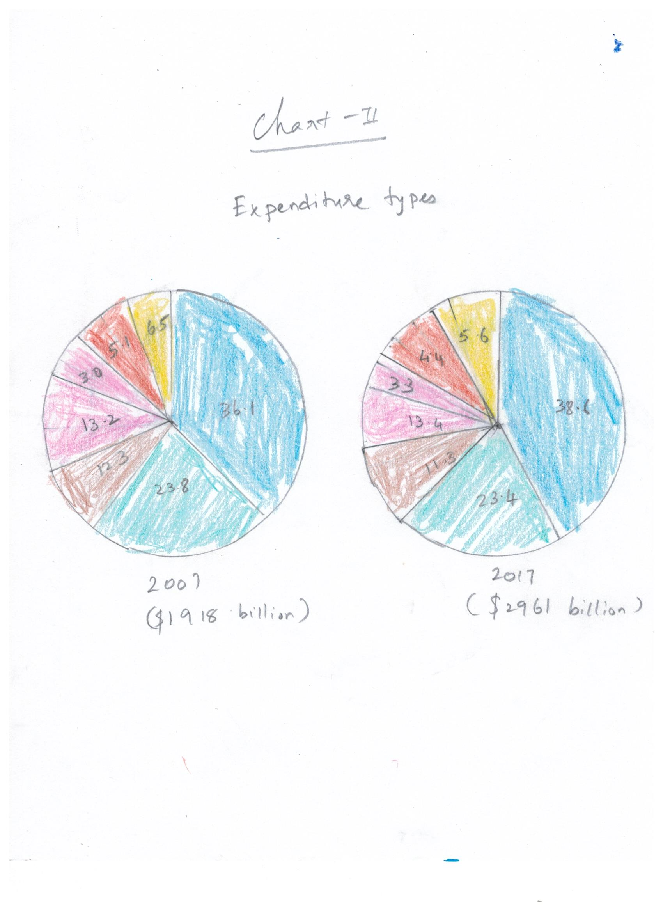
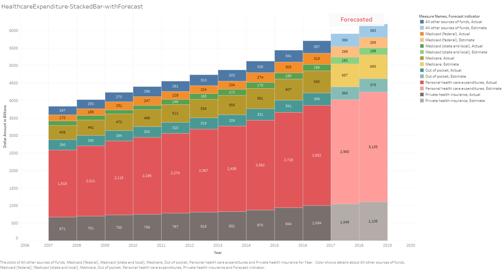

# Introduction

Healthcare costs in the US increase year by year significantly. Even though the Government takes active steps in minimizing the burden of the citizens thru Medicare and Medicaid, people spend more money on personal healthcare expenditures, private health insurance, and out of pocket expenses. The data for under discussion is sourced from the CDC(Center for Disease Control and Prevention) -  National Center for Health statistics. Even though the original chart intended for a different reason, if the audiences are Healthcare officials and Policy Makers are to view the same data, the task is how efficiently the original data be leveraged to make the communication more effective by different visualization.

**SOURCE: National Center for Health Statistics. Health, United States, 2018. Hyattsville, Maryland. 2019.**
[CDC Link](https://www.cdc.gov/nchs/hus/contents2018.htm?search=Health_expenditures)  

[Source Data](https://ftp.cdc.gov/pub/Health_Statistics/NCHS/Publications/Health_US/hus18figures/fig18.xlsx)  

[Original Visualization](https://www.cdc.gov/nchs/ppt/hus/hus18fig18.pptx)  
  

# Wireframe Mockup

# Wireframe review and Feedback

  Following questions were asked based on wireframe mockup that was created. 
  * Can you tell me what you think this is?
  * Can you describe to me what this is telling you?
  * Is there anything you find surprising or confusing?
  * Who do you think is the intended audience for this?
  * Is there anything you would change or do differently?

  Reviewers were able to identify what was that about as the Title , legend, X and Y axis provided a fair idea on what it contains.
  They also did not like the colors used. Questions were around what does the color represent.Both reviewers liked the way that was represented in
  the mockup was bit detailed than the original graph.

  Following feedback were received based on the wireframe.
  * Give  more details on the exact amount spend.
  * Give a way to forecast the next 2 years
  * Show chart comparing government funded and other sources like Personal,Private,Out of pocket etc.
  * Retain the original chart for chart-2. Pie chart did not provide more information. Original Stacked bar was much better.
  
  I did not perform any data visualization changes to chart-2 as it conveyed relevant information. 
  Only suggestion I received was to show more data as 10 years is a huge gap.As the original data 
  for chart-2 doesnt have for other years except 2007 and 2017, I did not try other visualization.
    

# New Visualizations

## Stacked Bar chart (Generated from flourish)
> *Below chart publishes Health care expenditures in USA for the period of 2007-2017 on a Stacked Bar chart*

## Stacked Bar chart - Forecasted (Generated from Tableau)

## Multiple Pie chart (Generated from flourish)
> *Below chart publishes Health care expenditures in USA for the period of 2007-2017 on a Pie chart*

## Bubble-Plot (Generated from flourish)
> *Below chart publishes Health care expenditures in USA for the period of 2007-2017 on a Bubble Plot*

## Stacked Column Chart (Generated from flourish)
> *Below chart publishes Health care expenditures in USA for the period of 2007-2017 on a Stacked Column chart*

# Explanation (Generated from flourish)
I tried different visualizations in flourish and tableau
For some of them I need to do transformations to get the plot right.

Out of all charts I preferred Stacked Bar chart to be better visualization for the dataset provided.
