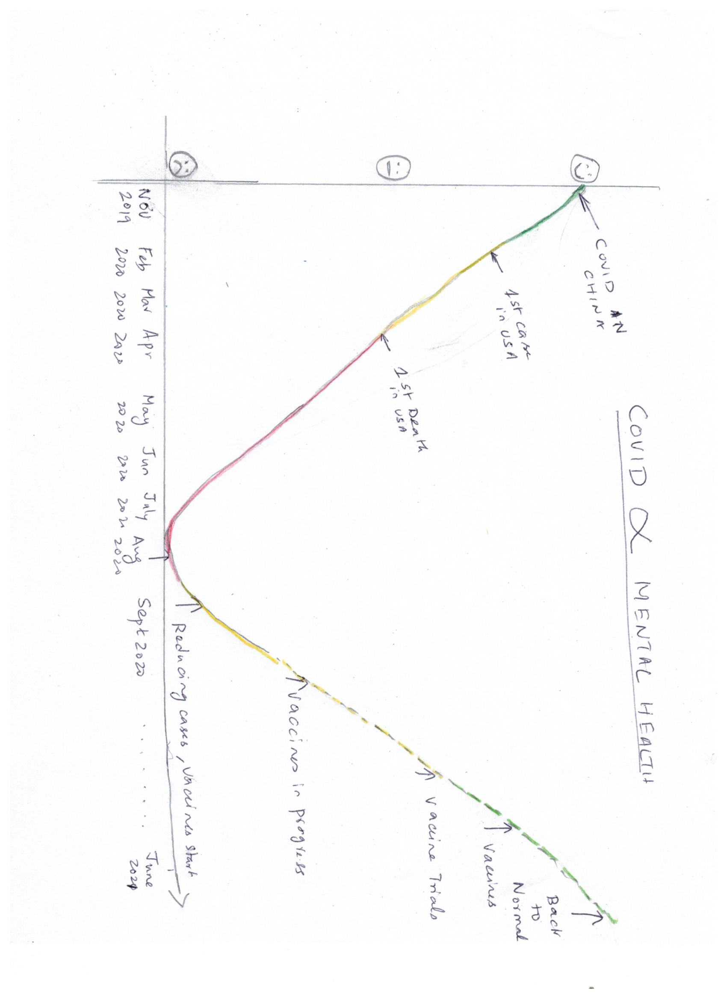
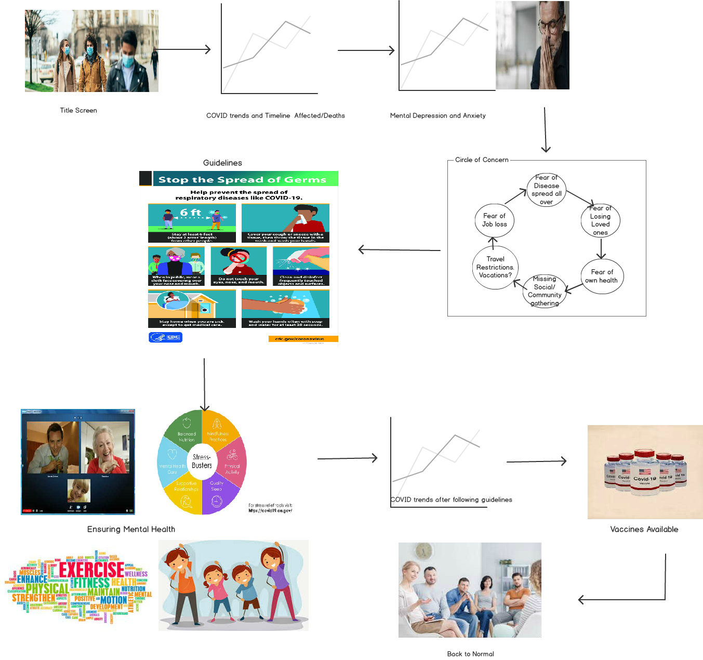

<h1><b>Just beat it - Winning over Crisis</b></h1>

## Introduction

Recent COVID-19 pandemic has impacted the world in a big way. Normal life in the world has changed a lot since then. Social Distancing is becoming a popular term than Social networking. Governments across the world are taking active steps in mitigating this pandemic and encouraging citizens to be safe in whatever way they can. Majority of the companies where remote working can be accomplished are fully embracing the technology. Schools across the world are slowly adopting remote curriculum and learning. The entire population is adopting new means to interact with the world. While a lot has been talked about COVID impacts and safety on a macro level, I would like this project to be more focused on the micro-level namely - an Individual. This article will predominantly focus on mental health (to overcome anxiety and depression) during these tough times and come out of this situation successfully. This can apply to any tough situation humanity faces and not necessarily COVID. However, COVID is taken as an example to highlight the mental health. While some of the data used for visualization are sourced from different 

## Audience

This project is targeted for all individuals who would like to keep up their mental health who is currently missing social interactions and outdoor activities. Majority of the information in this project is based on my personal views and information available in websites (which will be cited). I am by no means an expert on this topic, but I strongly believe that with a strong mental health and support system we can go through any crisis times successfully.

## Story Arc and Call for action
Below is the story I framed.  
"As an Individual,Inspite of uncertainties around the world like COVID 19, I would like to remain positive by maintaining physical, mental, and emotional wellbeing so that I can overcome this situation gracefully. I can overcome this by keeping me informed through right sources, having an active lifestyle, following the prescribed guidelines from Government and seeking counselling if required."

## Topics addressed

I would like to basicaly apprise the audience with the avenues that would be used to keep the mental health in the better shape:
  * How physical health and activity will take of mental health?
  * How can we improve it?
  * what are the ways to improve it?
  * what are the ways to keep informed?
  * what are the ways to keep socially connected?
  * How to cope up with anxiety and depression because of lost job,health etc?

## Wireframe Mockup

I did a wireframe mockup to better represent the story arc provided.Even though chart talks specifically to a COVID situation it is generally applicable to any crisis in the world.

## Data

Mental Health data source in CDC [click here](https://www.cdc.gov/mentalhealth/) . This site has comprehensive inforamtion about Mental Health. This will be my primary source of data for the project.

Covid Cases and Dealth data [click here](https://data.cdc.gov/Case-Surveillance/United-States-COVID-19-Cases-and-Deaths-by-State-o/9mfq-cb36/data) . This is to show how any crisis can impact us.

Anxiety and Depression due to COVID [click here](https://data.cdc.gov/NCHS/Indicators-of-Anxiety-or-Depression-Based-on-Repor/8pt5-q6wp). This site has a report which is downloable which mainly deals with Anxiety and depression.

Our world in Data provides lot of interesting data about Mental health [click here](https://ourworldindata.org/mental-health#licence)

Centre Signature data bank for Mental Health [click here](http://www.banquesignature.ca/en/a-propos/centre-signature/)

Substance Abuse and Mental Health Data Archive [click here](https://www.datafiles.samhsa.gov/)

Mental Health in Tech Industry [click here](https://www.kaggle.com/anth7310/mental-health-in-the-tech-industry?select=mental_health.sqlite)

## Method and Medium

I am planning to use Tableau as the main tool to create Visualizations. The visualizations I am planning is mostly from CDC and other websites related to mental health.I am thinking about close to 4-5 visualizations.  
I will be using Shorthand for my final project presentation.For images in my presentation I would source it from [Unsplash](https://unsplash.com/)

## Links that will be referred

American Psychological Association data [click here](https://www.apa.org/research/responsible/data-links)

Mental Health and Psychology related articles are available [click here](https://www.apa.org/monitor/2011/12/exercise)

Daily Exercise and Mental Health [click here](https://www.sciencedaily.com/releases/2018/08/180808193656.htm#:~:text=2-,Exercise%20linked%20to%20improved%20mental%20health%2C%20but,may%20not%20always%20be%20better&text=Summary%3A,people%20who%20do%20not%20exercise.) 

Anxiety and depression Pulse survey [click here](https://www.cdc.gov/nchs/covid19/pulse/mental-health.htm)

Mental health before and during the COVID-19 pandemic [click here](https://www.thelancet.com/journals/lanpsy/article/PIIS2215-0366(20)30308-4/fulltext)

Mental Health and COVID [click here](https://mhanational.org/covid19)

North Sound Behavioral Health [click here](https://nsbhaso.org/)

## Conclusion 
More to come
