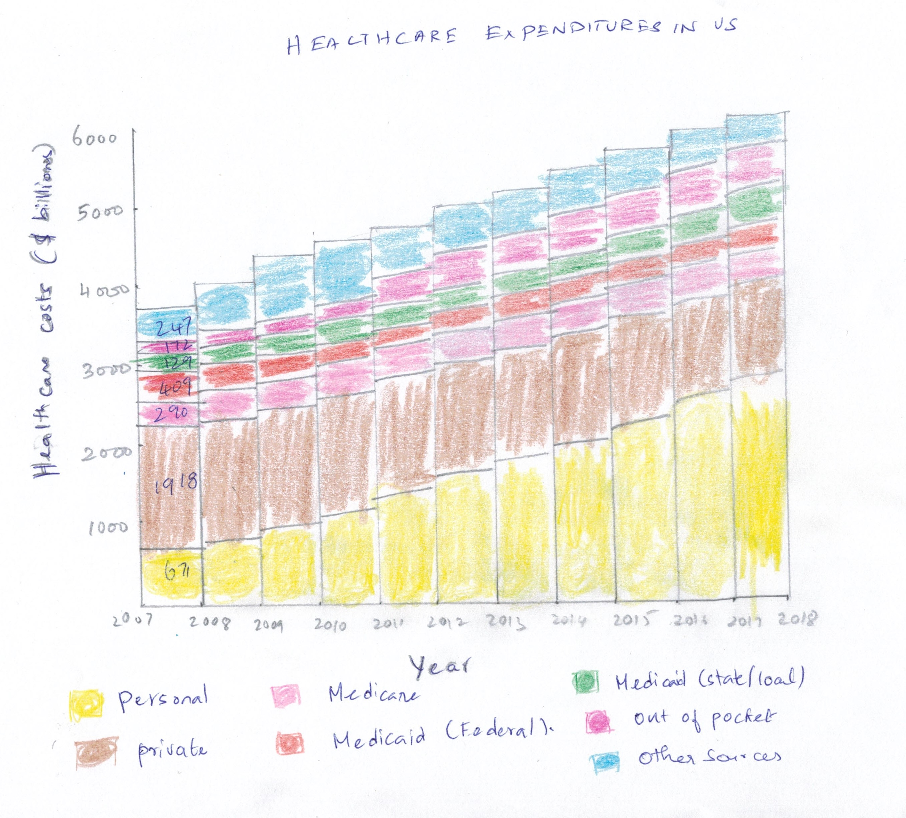
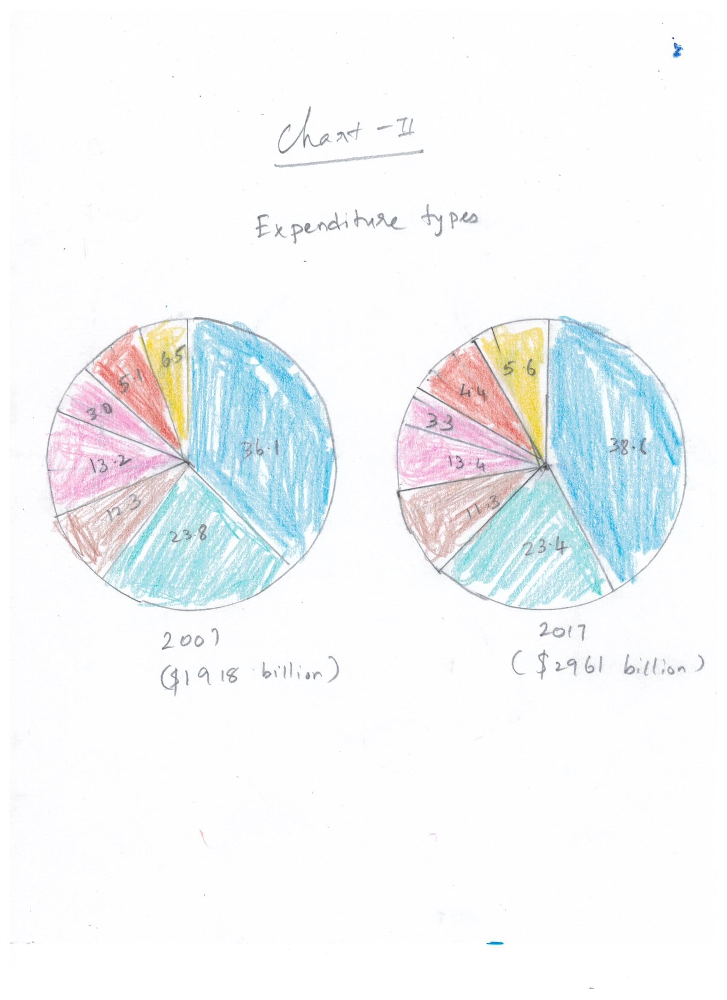

# Introduction

Recent COVID-19 pandemic has impacted the world in a big way. Normal life in the world has changed a lot since then. Social Distancing is becoming a popular term than Social networking. Governments across the world are taking active steps in mitigating this pandemic and encouraging citizens to be safe in whatever way they can. Majority of the companies where remote working can be accomplished are fully embracing the technology. Schools across the world are slowly adopting remote curriculum and learning. The entire population is adopting new means to interact with the world. While a lot has been talked about COVID impacts and safety on a macro level, I would like this project to be more focused on the micro-level namely - an Individual. This article will predominantly focus on mental health (to overcome anxiety and depression) during these tough times and come out of this situation successfully. This can apply to any tough situation humanity faces and not necessarily COVID. However, COVID is taken as an example to highlight the mental health. While some of the data used for visualization are sourced from different 

# Audience

This project is targeted for all individuals who would like to keep up their mental health. Majority of the information are based on personal ideas. I am by no means an expert on this topic, but I strongly believe that with a strong mental health and support system we can go through any crisis times successfully.

# Story Arc and Call for action

As an Individual,Inspite of uncertainties around the world because of COVID 19, I would like to remain positive by maintaining physical, mental, and emotional wellbeing so that I can overcome this situation gracefully. I can overcome this by keeping me informed through right sources, having an active lifestyle, following the prescribed guidelines from Government and seeking counselling if required.

**SOURCE: National Center for Health Statistics. Health, United States, 2018. Hyattsville, Maryland. 2019.**  

[CDC Link](https://www.cdc.gov/nchs/hus/contents2018.htm?search=Health_expenditures)  

[Source Data](https://ftp.cdc.gov/pub/Health_Statistics/NCHS/Publications/Health_US/hus18figures/fig18.xlsx)  

[Original Visualization](https://www.cdc.gov/nchs/ppt/hus/hus18fig18.pptx)  
  

# Wireframe Mockup

I did a wireframe mockup to better represent the original chart provided.Even though original chart provided relevant information, I tried to enhance based on the critique evaluation I performed.

# Wireframe review and Feedback

  Following questions were asked based on wireframe mockup that was created. 
  * Can you tell me what you think this is?
  * Can you describe to me what this is telling you?
  * Is there anything you find surprising or confusing?
  * Who do you think is the intended audience for this?
  * Is there anything you would change or do differently?

  Reviewers were able to identify what was that about as the Title , legend, X and Y axis provided a fair idea on what it contains.
  They also did not like the colors used. Questions were around what does the color represent.Both reviewers liked the way that was represented in
  the mockup was bit detailed than the original graph.

  Following feedback were received based on the wireframe.
  * Give  more details on the exact amount spend.
  * Give a way to forecast the next 2 years
  * Show chart comparing government funded and other sources like Personal,Private,Out of pocket etc.
  * Retain the original chart for chart-2. Pie chart did not provide more information. Original Stacked bar was much better.
  
  I did not perform any data visualization changes to chart-2 as it conveyed relevant information. 
  Only suggestion I received was to show more data as 10 years is a huge gap.As the original data 
  for chart-2 doesnt have for other years except 2007 and 2017, I did not try other visualization.
    

# New Visualizations

## Stacked Bar chart (Generated from flourish)
> *Below chart publishes Health care expenditures in USA for the period of 2007-2017 on a Stacked Bar chart*

## Stacked Bar chart - Forecasted (Generated from Tableau)
> *Below chart publishes Health care expenditures in USA for the period of 2007-2017 with forecasted information for the next 2 years*

For subsequent plots I had to transpose data from rows to columns to get the desired plotting as there were missing dimensions.

## Stacked Area chart (Generated from Tableau)
> *This is the Stacked area representation of the same data. It gives an idea how each of the costs increase in an area-wise representation*

## Bar Graph with  Medicare/Medicaid VS Non Medicare/Medicaid(Generated from Tableau)
> *This graph stricly compares Medicare/Medicaid program costs with costs incurred by the patient. This gives a straightforward view whether Medicare/Medicaid provides sufficient funds to help citizens in the increasing healthcare costs *

## Multiple Pie chart (Generated from flourish)
> *Below chart publishes Health care expenditures in USA for the period of 2007-2017 on a Pie chart. I tried for visualization purposes*

## Bubble-Plot (Generated from flourish)
> *Below chart publishes Health care expenditures in USA for the period of 2007-2017 on a Bubble Plot. I tried for visualization purposes. Not a right fit*

## Stacked Column Chart (Generated from flourish)
> *Below chart publishes Health care expenditures in USA for the period of 2007-2017 on a Stacked Column chart. Gives an year by year view.*

# Conclusion 
I tried different visualizations in flourish and tableau.For some of them I need to do transformations to get the plot right.
Out of all charts I preferred Stacked Bar chart to be better visualization for the dataset provided. Also, Forecasting costs based on the trend will 
provide significant value to key stakeholders who are involved in healthcare domain.

